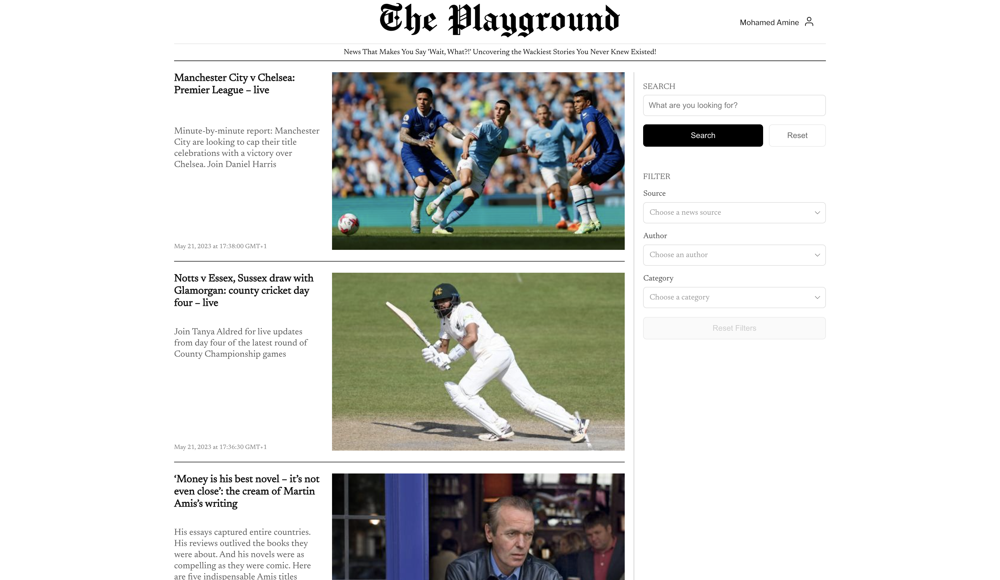
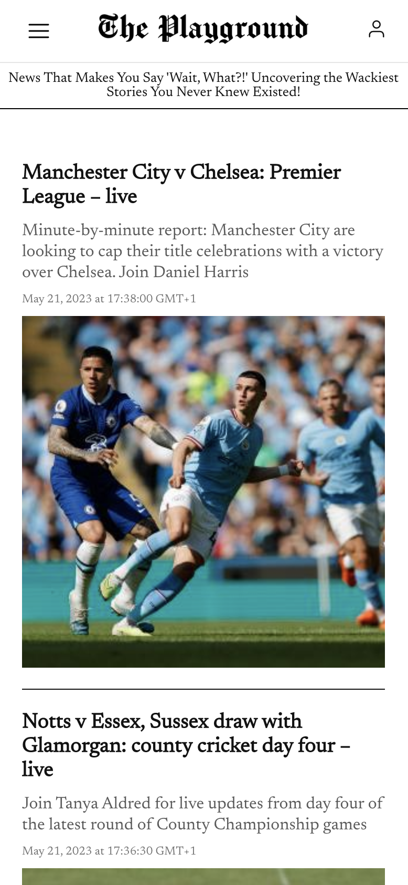

# The Playground
A news aggregator website that pulls articles from various sources and displays them.

## API providers
1. NewsAPI.org
2. The Guardian
3. New York Times

## How to run

Running the project is straight forward since it's dockerized.

1. Clone the repository.
2. `cd` into the repository.
3. Run `docker-compose up`.
4. While still inside the repository, run `docker-compose exec backend php artisan migrate:fresh --seed` to run the migration and seed the database with a test user.

That's it, the project will run on `localhost:80`. There's an Nginx reverse proxy that handles communication between react and Laravel, so that both applications can run on the same top level domain, that way Sanctum's authentication would work.

No extra configuration is need, .env already has keys for the API which you're free to use.

You can login using the existing credentials below or create a new user.
- email: `johndoe@example.com`
- password: `password`

## Screenshots

